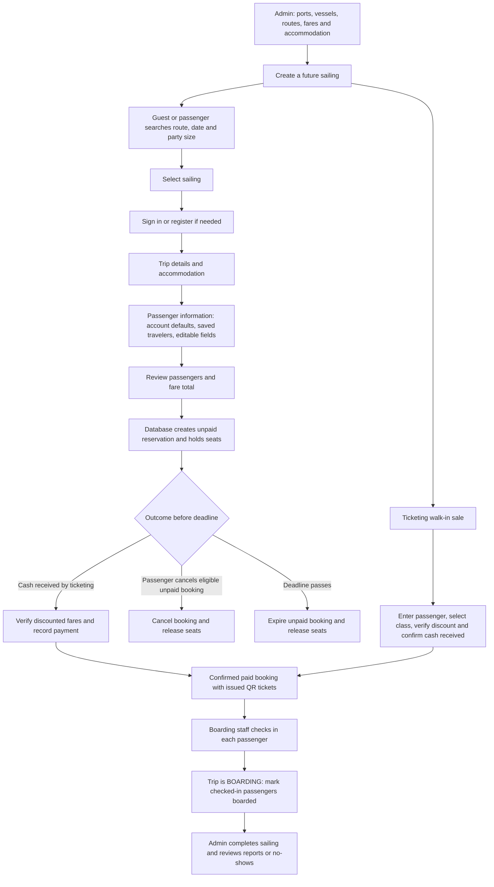
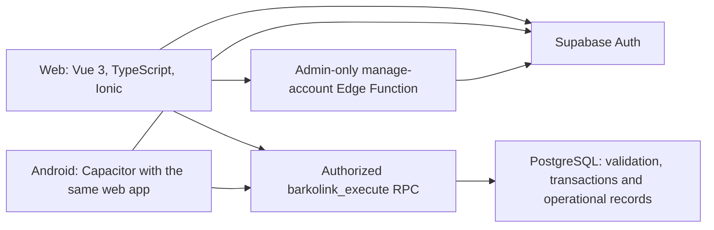

# BarkoLink system flow and presentation guide

Prepared from the local implementation on 6 October 2026. This guide describes source-code behavior, including the recent registration/privacy, passenger header, booking autofill, and review-screen changes. Dataset counts and deployment statements in older documents are historical; this scan does not verify current hosted records or deployment status.

## 1. Opening explanation

“Ang BarkoLink ay isang web at Android ferry booking and passenger management system. Pinagdurugtong nito ang passenger reservation, ticketing at cash payment, QR ticket issuance, check-in, boarding, at administrative reporting. May apat na account roles upang malinaw kung sino ang puwedeng gumawa ng bawat transaction.”

Main story: **Admin prepares the sailing → Passenger reserves seats → Ticketing records cash payment → Passenger receives QR tickets → Boarding staff checks in and boards passengers → Admin monitors operations and reports.**

## 2. Actors and responsibilities

| Actor | Responsibilities | Workspace |
| --- | --- | --- |
| Guest | Browse landing page, schedules, port information, help and privacy; register or sign in | `/`, `/search`, `/help`, `/privacy` |
| Passenger | Reserve trips, review own bookings, view issued tickets, maintain profile and saved travelers, read notifications | `/home` |
| Ticketing staff | Find reservations, verify discount eligibility, record cash payment, issue walk-in tickets, record eligible cash refunds | `/staff/ticketing` |
| Boarding staff | Select a sailing, find/scan tickets, check in passengers, record boarding, inspect manifest/activity | `/staff/boarding` |
| Admin | Manage operational reference data, trips, fares, accounts, advisories, broadcasts, manifests, no-shows, reports and audit records | `/admin` |

Guest is an access state, not another authenticated account role. `WALK_IN` is a backend guest-record classification; it is not a fifth login workspace. Admin also has access to authorized staff operations.

## 3. Overall workflow

The core payment is **cash at the terminal**, recorded by authorized staff. Booking confirmation in the review UI first creates a reservation; the paid ticket becomes usable after ticketing records payment.

## 4. Passenger journey, screen by screen

1. **Landing and search.** General Book a Trip/Book Now opens all upcoming sailings. A landing route card supplies its route and date. Search sailings uses the form's origin, destination, date and passenger count. Results show departure/arrival, vessel, fares and available capacity.
2. **Account access.** Guests can browse. Selecting a sailing for booking requires authentication. The sign-in redirect preserves the intended booking destination. Self-registration creates a Passenger account; email confirmation depends on backend configuration.
3. **Privacy acknowledgement.** Registration links to the privacy notice and returns to registration with its form preserved during the in-app detour. The user manually checks acknowledgement; opening the notice does not check it automatically.
4. **Trip details.** Review the sailing and select an accommodation class when the vessel has active classes. Capacity and surcharge depend on the selected class.
5. **Passenger information.** An online booking supports 1–8 passengers, within available capacity. The first blank passenger receives the available account name and phone. A uniquely name-matching saved traveler supplies birthday, sex and nationality, plus phone when the account has none. With missing or ambiguous saved data, those fields need manual confirmation. Defaults remain editable. Choosing a saved traveler fills that passenger's details; the fare category is chosen for this booking.
6. **Review.** Check route, departure, vessel, individual passenger details, category fares, accommodation surcharge and total. Edit trip returns to trip details; Edit passengers returns to the passenger form. Draft edits survive normal review/back navigation and reload.
7. **Reservation.** Confirm submits the booking to the backend. The backend checks identity, roles, schedule, seats, class capacity and fares. A successful online reservation holds seats and produces a booking reference and payment deadline.
8. **Cash payment and tickets.** Show the reference at the ticketing desk. Staff verifies discounted fares and records cash received. The passenger can then view each issued QR ticket, download a copy, print/save PDF or share where supported.
9. **Terminal.** Present each passenger's ticket. Boarding staff validates its current database state, checks in the passenger, and then records boarding when the sailing is BOARDING.

Passenger navigation: Home, Trips, Bookings and Profile in the bottom navbar; Notifications in the header bell. Help, Privacy and Logout are reachable through Profile. Booking screens use the shared header plus a contextual back link.

## 5. Three different status lifecycles

| Moment | Booking status | Payment status | Individual ticket status |
| --- | --- | --- | --- |
| Online reservation created | `PENDING` | `UNPAID` | `PENDING` |
| Cash payment recorded | `CONFIRMED` | `PAID` | `ISSUED` |
| Passenger checked in | `CONFIRMED` | `PAID` | `CHECKED_IN` |
| Passenger boarded | `CONFIRMED` | `PAID` | `BOARDED` |
| Eligible unpaid booking cancelled | `CANCELLED` | `UNPAID` | Remains pending/ineligible for terminal actions |
| Unpaid reservation expires | `EXPIRED` | `UNPAID` | Ineligible for terminal actions |
| Paid sailing cancelled by operator | `CANCELLED` | `REFUND_PENDING` | Ineligible for terminal actions |
| Staff records returned cash | `CANCELLED` | `REFUNDED` | Ineligible for terminal actions |

Ticketing walk-in sales enter directly as **CONFIRMED / PAID / ISSUED** after the cash-received action succeeds. One booking can contain several passengers, each with their own ticket and attendance status.

Sailing status is a separate lifecycle: `SCHEDULED`, `DELAYED`, `BOARDING`, `COMPLETED`, or `CANCELLED`. These statuses enable or block operational actions; they are not a single automatic clock-driven sequence. Check-in can occur for an eligible issued ticket on an active scheduled/boarding trip. Boarding requires a checked-in ticket and a BOARDING sailing.

## 6. Ticketing and walk-in operations

For an existing online reservation: search the booking → inspect passengers and amount → verify discounted fares → receive cash → confirm payment → view receipt/issued tickets. Payment does not deduct seats again because reservation already held them.

For a walk-in: select a future available sailing → enter passenger details → choose class/category → verify discount if needed → review cash payment → confirm cash received and issue ticket. A walk-in traveler does not need a passenger login. The current guest walk-in form is a single-passenger sale.

For refunds: inspect an eligible refund-pending booking → physically return cash → record the refund receipt/note → confirm cash returned. The app records cash activity; it does not electronically transfer a refund.

## 7. Admin setup and daily operations

Recommended setup order: **Ports and vessels → routes → vessel fares and accommodation → future sailing → staff accounts → operational transactions.** Some editors may require already-created reference data; the vessel must exist before configuring its classes/fares.

Admin monitors bookings/passengers, adjusts permitted schedules and sailing statuses, views trip operations and the manifest, publishes advisories, sends internal notifications, and reviews reports. On departed completed sailings, no-show reconciliation records eligible paid passengers who did not board. Reports cover collections, reservations, passenger categories, attendance, cancellation/refund information and trends. Audit records identify operational actions and their actors.

## 8. Controls to explain during defense

| Situation | Implemented control |
| --- | --- |
| Two people request the last seats | Database transactions and locks recheck capacity before committing; class inventory is also checked |
| Browser sends a changed price | Backend computes the applicable fare and surcharge |
| Someone opens an admin URL | Router checks session/role; backend separately enforces permission |
| Passenger requests someone else's records | Owner-scoped backend operations use authenticated identity |
| Request is retried after uncertain response | Booking references and transaction checks prevent another seat allocation for the same valid request; UI preserves retry intent |
| Ticket is scanned twice | Ticket lifecycle checks block another check-in/boarding transition |
| An unpaid booking expires | Backend expiry releases reserved seats; the displayed countdown reflects the stored deadline |
| Operator cancels a paid sailing | Paid bookings become refund pending; staff records returned cash |
| Vessel has overlapping active schedules | Database schedule validation rejects conflicts |

Default reservation duration is 24 hours, capped at departure. Admin can configure the duration for new reservations. Backend expiry is implemented through scheduled processing and normal API requests; the browser countdown alone does not release seats.

## 9. Architecture and data model

Vite builds the frontend. Vercel configuration provides SPA routing for web hosting. Capacitor packages the built web interface for Android. Both use the same Supabase backend. Admin/staff tables use AG Grid and shared UI components.

Key relationships:

- An account owns bookings, notifications and saved travelers.
- A sailing belongs to a vessel and references origin/destination ports.
- A booking belongs to an owner and sailing, and can reference an accommodation class.
- A booking contains passenger records; each passenger has a unique ticket code and attendance timestamps.
- Boarding events reference passenger records and acting staff.
- Supporting tables store fares, routes, advisories, broadcasts, operation settings, no-shows and activity logs.

Browser requests use the typed service layer and PostgreSQL RPC. Tables have RLS enabled and direct browser table privileges are restricted; private operations enforce identity, role and ownership. Supabase Auth manages credentials. Staff-role authority is server-managed account metadata. The manage-account function requires Admin and uses server-side credentials.

## 10. Suggested 10-slide presentation

| Slide | What to show | What to explain |
| --- | --- | --- |
| 1 | Title and landing page | Purpose: connect ferry booking with terminal passenger management |
| 2 | Problem and objectives | Reduce repeated passenger entry; keep reservation, payment and attendance records connected |
| 3 | Four roles | Responsibility and restricted access of each workspace |
| 4 | Overall flowchart | Follow one booking from sailing setup to boarding |
| 5 | Passenger search and booking | Account defaults, saved travelers, accommodation and editable review |
| 6 | Ticketing | Cash collection, discount verification and walk-in sale |
| 7 | QR ticket and boarding | One ticket per passenger; check-in precedes boarding |
| 8 | Admin | Reference data, schedules, manifest, reports, communication and audit |
| 9 | Architecture and controls | Shared web/Android backend, role checks, owner isolation and capacity transactions |
| 10 | Validation, scope and conclusion | Demonstrate tested behavior and state the deployment/device acceptance actually completed |

Describe expected operational benefits as objectives unless you have measured user-test results. Test counts recorded in old docs are historical; quote a specific test run and date if the panel asks for numbers.

## 11. Live demonstration order

Use separate browser profiles for Passenger, Ticketing, Boarding and Admin. Prepare a future sailing with enough available seats and the chosen accommodation. The demonstration changes normal records, so use approved demo data.

1. Admin: show the sailing, fare and capacity.
2. Passenger: search → select → account/saved-traveler details → edit one field → review → reserve. Note the generated reference and reduced seats.
3. Ticketing: find that exact reference → verify any discounted category → record simulated/demo cash received → show issued ticket/receipt.
4. Passenger: refresh bookings and show issued QR tickets.
5. Boarding: select the correct sailing → scan/find ticket → check in.
6. Admin: set the sailing to BOARDING.
7. Boarding: board the checked-in passenger. Show that a repeated scan cannot create another boarding transition.
8. Admin: show matching manifest, collection and attendance records. Complete the sailing and demonstrate no-shows only on an appropriate departed completed case.

Optional second scenario: unpaid cancellation and restored seats. Use a separate eligible booking rather than the paid booking from the main demonstration.

Choose dates from the actual UI before presenting. Historical demo references and relative-time fixtures in `DEMO-WORKFLOWS.md` may have departed, expired or already been processed.

## 12. Common panel questions

**Why separate Passenger, Ticketing, Boarding and Admin?** To assign actions to their operational owner and restrict access. Booking ownership and staff permissions are also checked in the backend.

**When is a seat deducted?** When the reservation or walk-in transaction commits. Paying an existing reservation does not deduct it a second time.

**What if two users book the last seat?** The database locks and validates the remaining inventory inside the transaction. The request that cannot fit is rejected.

**Can a passenger book for other people?** Yes. The logged-in account owns the reservation; each listed traveler has their own passenger record and ticket. Owner defaults can be edited or replaced using Saved Travelers.

**Does autofill contain all account-owner identity details?** Account profile provides name and phone. Extra identity fields come from a uniquely matching Saved Traveler when available. The user reviews missing or ambiguous information.

**Does a QR image alone guarantee valid boarding?** Staff verifies the ticket's current record, paid booking, attendance state and selected sailing. A downloaded ticket can be retained offline, but terminal validation requires backend access.

**How are discounts protected?** Fares are calculated using the sailing configuration; ticketing verifies the eligibility of discounted passengers before payment/issuance. Category selection alone does not approve a discount.

**What if the user never pays?** The reservation has a stored deadline. Backend expiry changes it to EXPIRED and releases seats.

**What happens if the operator cancels?** Active unpaid bookings are cancelled; paid bookings enter refund-pending processing. Ticketing records the actual returned cash.

**Why Supabase?** The implementation combines authentication, PostgreSQL data/transactions, and a protected account-management function behind the web/Android interface.

**Can the system work entirely offline?** Tickets can be downloaded for viewing/printing. Authentication, new reservations, payment recording and terminal state updates use the backend connection.

**What is the present scope?** Passenger ferry reservations, counter cash ticketing, walk-in sales, accommodation inventory, QR attendance and administrative operations. Describe production hosting, email delivery, camera/printer and physical Android acceptance according to what your team has actually demonstrated.

## 13. Implementation references

| Topic | Source |
| --- | --- |
| Role routes and guards | `src/router/index.ts`, `src/data/sessionRole.ts` |
| Account access/privacy detour | `src/views/auth/AuthPage.vue`, `src/views/auth/PrivacyNoticePage.vue` |
| Booking and owner defaults | `src/views/passenger/BookingFlowPage.vue`, `src/data/bookingPassenger.ts` |
| Saved Travelers | `src/views/passenger/TravelersPage.vue`, `src/components/passenger/SavedTravelerPicker.vue` |
| Cash ticketing and walk-in | `src/views/staff/ticketing/TicketingPage.vue`, `TicketingWalkInPage.vue` |
| QR/check-in/boarding | `src/views/staff/boarding/StaffBoardingPage.vue`, `src/data/ticketExport.ts` |
| Admin modules | `src/views/admin/AdminWorkspacePage.vue`, `src/components/admin/` |
| Secured data calls | `src/services/database/client.ts`, passenger/staff/operations/experience/workspace services |
| Data, inventory and authorization | `supabase/migrations/001_schema.sql` through `018_admin_directory_filters.sql` |
| Account-management permissions | `supabase/functions/manage-account/index.ts` |
| Guided transactions | `docs/MANUAL-FLOW-TEST.md`, `docs/DEMO-WORKFLOWS.md` |
| Hosting/native setup | `vercel.json`, `capacitor.config.ts`, `docs/VERCEL-DEPLOYMENT.md`, `docs/ANDROID.md` |

Read migrations in numeric order: later migrations extend earlier schema/operations. Older upgrade documents describe the features available at their writing date and may omit later accommodation, discount, filtering and UI changes.
